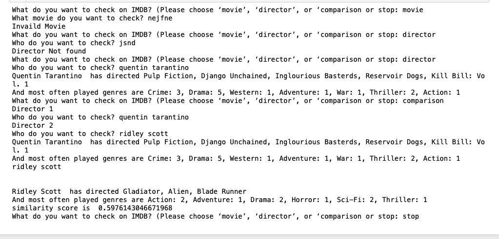

# IMDb Movie Exploration and Director Genre Analysis

## Summary

Developed a Python script using web scraping and Selenium to extract information from IMDb's top-rated movies. The script fetched movie titles, directors, and genres, creating a comprehensive dataset for analysis.

- Utilized object-oriented programming to structure movie data within a custom class, encapsulating titles, directors, and genres.
- Employed Selenium to handle dynamic content loading, ensuring accurate extraction from pages that did not load conventionally.
- Implemented CSV functionality for storing collected movie data, facilitating easy access and sharing.

Created interactive functions enabling users to explore movies, directors, and compare genre preferences. The comparison feature utilized vector distance and cosine similarity, providing insights into directorial styles.

This project enhanced proficiency in web scraping, data manipulation, and real-world data analysis using Python.

## Output
